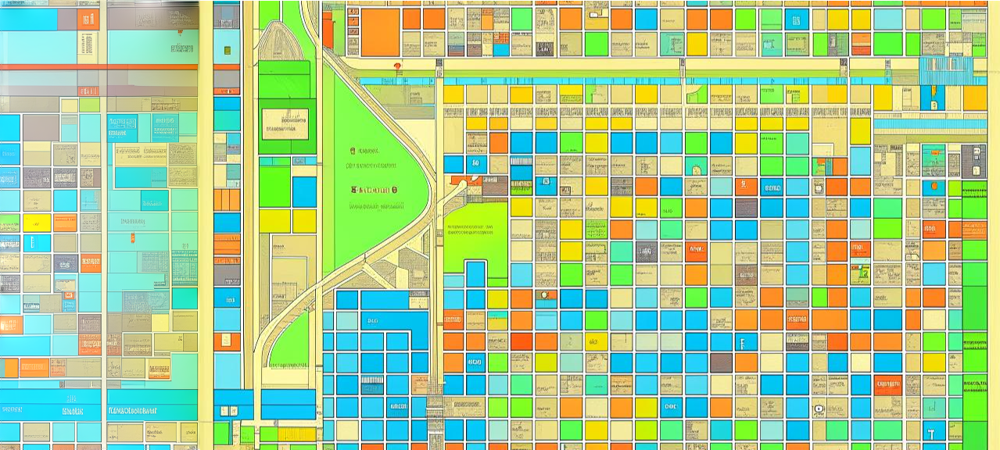

# SimpleNavigator

Реализация проекта Simple Navigator.

Групповой проект выполнен совместно с: \
  [Vlad Kolesnik](https://github.com/VAKoleso) \
  [Alexey Batyuta](https://github.com/tszechwa)

## Contents

0. [Введение](#введение)
1. [Основные определения](#основные-определения)
2. [Реализация](#реализация) \
3. [Консольный интерфейс](#консольный-интерфейс)   



## Введение

В данном проекте Нам предстояло реализовать несколько основных алгоритмов на графах. Графы являются одной из базовых структур данных в программировании, которая используется повсеместно. В виде графов можно, например, интерпретировать схемы дорог, электрические цепи, географические карты, связи между людьми в социальных сетях и многое, многое другое.  

В рамках данного задания все графы удовлетворяют следующим требованиям:
- Веса ребер только натуральными числами
- Могут быть петли
- Веса могут отличаться на всех ребрах
- Только ненулевой связный граф

## Реализация

* Библиотеки разработаны на языке С++ стандарта C++17 
* При написании кода придерживались Google Style
* Решение оформлено как статическая библиотека
* Библиотека s21_graph.h и s21_graph_algorithms.h представлена в виде класса `Graph`, который хранит в себе информацию о графе с помощью **матрицы смежности**. Размерность матрицы смежности задается динамически при инициализации графа (при его загрузке из файла)
* Библиотека s21_graph_algorithms.h представлена в виде класса `GraphAlgorithms`, который будет содержать в себе реализацию алгоритмов на графах. При этом сам класс `GraphAlgorithms` ничего не знает о внутреннем представлении графа из класса `Graph`. Для взаимодействия с данными графа класс `GraphAlgorithms` используются только публичные методы и свойства, предоставляемые классом `Graph`.
* Сборка программы настроена с помощью Makefile со стандартным набором целей для GNU-программ: _all, clean, test, s21_graph.a_, s21_graph_algorithms.a_
* Обеспечено покрытие unit-тестами методов класса `Graph` и `GraphAlgorithms`


* Класс `Graph` содержит в себе следующие публичные методы:
    + `loadGraphFromFile(string filename)` - загрузка графа из файла в формате матрицы смежности
    + `exportGraphToDot(string filename)` - выгрузка графа в файл в формате dot (см. материалы)


* Класс `GraphAlgorithms` содержит в себе следующие публичные методы:    
    + `depthFirstSearch(Graph &graph, int startVertex)` - *нерекурентный* поиск в глубину в графе от заданной вершины. Функция возвращает массив, содержащий в себе обойдённые вершины в порядке их обхода. При реализации этой функции использовалась *самописная* структура данных **стек**, которая оформлена в виде отдельной статической библиотеки.
    + `breadthFirstSearch(Graph &graph, int startVertex)` - поиск в ширину в графе от заданной вершины. Функция возвращает массив, содержащий в себе обойдённые вершины в порядке их обхода. При реализации этой функции использовалась *самописная* структура данных **очередь**, которая оформлена в виде отдельной статической библиотеки.
    + `getShortestPathBetweenVertices(Graph &graph, int vertex1, int vertex2)` - поиск кратчайшего пути между двумя вершинами в графе с использованием *алгоритма Дейкстры*. Функция принимает на вход номера двух вершин и возвращает численный результат, равный наименьшему расстоянию между ними.
    + `getShortestPathsBetweenAllVertices(Graph &graph)` - поиск кратчайших путей между всеми парами вершин в графе с использованием *алгоритма Флойда-Уоршелла*. В качестве результата функция возвращает матрицу кратчайших путей между всеми вершинами графа
    + `getLeastSpanningTree(Graph &graph)` - поиск наименьшего остовного дерева в графе с помощью *алгоритма Прима*. В качестве результата функция возвращает матрицу смежности для минимального остовного дерева
    + `solveTravelingSalesmanProblem(Graph &graph)` - решение задачи коммивояжера с помощью *муравьиного алгоритма*. Нахождение самого выгодного (короткого) маршрута, проходящего через все вершины графа хотя бы по одному разу с последующим возвратом в исходную вершину. В качестве результата функция возвращает структуру `TsmResult`, описанную ниже:
    
    ```cpp
    struct TsmResult {
        int* vertices;    // массив с искомым маршрутом (с порядком обхода вершин)
        double distance;  // длина этого маршрута
    }
    ``` 
* Использовались *самописные* вспомогательные классы `Stack` и `Queue`. Эти классы содержат в себе следующие методы:
    + `init()` - создание пустого стек/очереди
    + `push(value)` - добавление элемента в стек/очередь
    + `pop()` - получение элемента из стека/очереди с его последующим удалением из стека/очереди
    + `peek()` - получение элемента из стека/очереди без его удаления из стека/очереди

## Консольный интерфейс

* Написана программа, которая представляет из себя консольное приложение для проверки работоспособности реализованных библиотек s21_graph.h и s21_graph_algorithms.h
* Консольный интерфейс покрывает следующий функционал:
    1. загрузка исходного графа из файла.
    2. обход графа в ширину с выводом результата обхода в консоль.
    3. обход графа в глубину с выводом результата обхода в консоль.
    4. поиск кратчайшего пути между произвольными двумя вершинами с выводом результата в консоль.
    5. поиск кратчайших путей между всеми парами вершин в графе с выводом результирующей матрицы в консоль.
    6. поиск минимального остовного дерева в графе с выводом результирующей матрицы смежности в консоль.
    7. решение задачи комивояжера с выводом результирующего маршрута и его длины в консоль.
